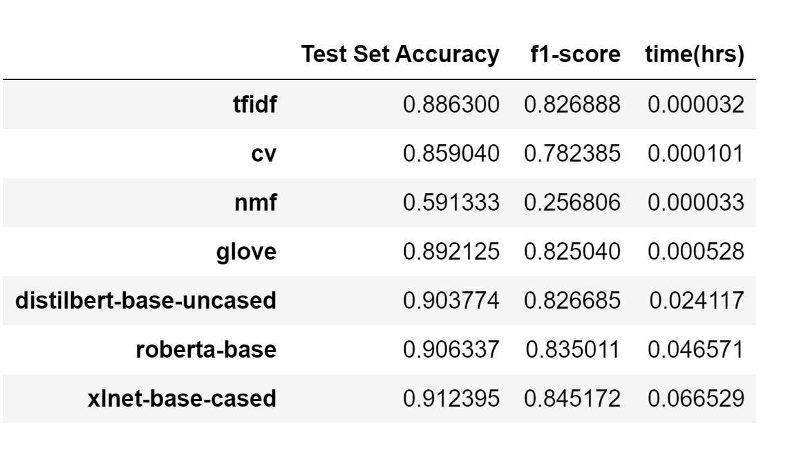

**ISMT S-117: Text Analytics & NLP Final Project**
==================================================

Title: Fine-tuning BERT for News Category Classification
--------------------------------------------------------

### Project Members:

1.  Praneet Singh Solanki ([*prs184@g.harvard.com*](mailto:prs184@g.harvard.com))
2.  Emmanuel Awa ([*ema142@g.harvard.com*](mailto:ema142@g.harvard.com))

## Overview

-   **Research question -** Enable users quickly classify news articles
    > into different categories of interest.

-   **What problem it solves -** With the influx of continuous
    > information available, is it possible to build a system that can
    > enable users to filter out different types of news content? This
    > information can be further used by a recommendation engine to
    > personalize news delivery of relevant categories to the users.

-   **What are different challenges -** Below are some challenges

    -   There is a lot of unstructured data. Most news articles do not
        > follow a single pattern which would make it easy to curate.

    -   The dataset we will be using has the news label, title and url
        > of the actual news, but does not contain the actual news
        > content. We would need to leverage BeautifulSoup and requests
        > libraries, respectively, to scrap the content. We will need to
        > implement an intelligent approach to the scaping such as
        > backoff algorithm, exponential request waiting to avoid
        > request throttling. Also we will ensure adherence to the
        > policy of the web page we’ll be scraping from.

### Inspiration

Our team at Microsoft focuses on making AI real through research and
engagements with customers. Our charter, in the next few months, is
focusing on building out a complete set of NLP toolkit with reusable
components that we can use while engaging in NLP projects. Based on past
engagements and learnings, one of our focus is on text classification of
news articles. This will feed into a bigger pipeline of capabilities
that will be operationalized for our daily work.

As members of the team, we have been tasked to find a way to bridge the
gap between this final project and our daily job in a way of creating
some of these reusable components. We’ve choose to do the news
classification for the following reasons:

-   **Availability of data** - Microsoft News team realized a new
    > challenge called
    > [*MIND*](https://msnews.github.io/index.html#getting-start)
    > consisting of a large corpora of news articles with labeled
    > categories as part of a recommendation challenge. We believe this
    > dataset can be leveraged for supervised NLP as well.

-   **Applicability of skill set to current day job at Microsoft -** As
    > mentioned above, we believe this final project will help us build
    > up skills for our actual day to day work. The learnings will
    > definitely be directly applicable.

-   **Research** - Text classification is a good place to start building
    > up NLP project portfolios

-   **Relevance -** With the current climate of fake news, having a
    > system that can distinguish what a news article is can feed into a
    > bigger system that can further classify if the news is real or
    > fake

## Dataset 

The MIND dataset is publicly available for research. We plan to take the [news.tsv](https://msnews.github.io/#getting-start) dataset (both train/val) for our news classification. It has 7 columns, which are divided by the tab symbol:

* News ID 
* Category 
* SubCategory
* Title
* Abstract
* URL
* Title Entities (entities contained in the title of this news)
* Abstract Entities (entites contained in the abstract of this news)

An example is shown in the following table:

Column | Content
------------- | -------------
News ID | N37378
Category | sports
SubCategory | golf
Title | PGA Tour winners
Abstract | A gallery of recent winners on the PGA Tour.
URL | https://www.msn.com/en-us/sports/golf/pga-tour-winners/ss-AAjnQjj?ocid=chopendata
Title Entities | [{"Label": "PGA Tour", "Type": "O", "WikidataId": "Q910409", "Confidence": 1.0, "OccurrenceOffsets": [0], "SurfaceForms": ["PGA Tour"]}]	
Abstract Entites | [{"Label": "PGA Tour", "Type": "O", "WikidataId": "Q910409", "Confidence": 1.0, "OccurrenceOffsets": [35], "SurfaceForms": ["PGA Tour"]}]

The most important columns are Category, SubCategory, Title, Abstract  and URL. The actual news content is not included in the dataset, but
it is left to the user to scrape it from the provided URL. We have used the columns **Category, Title, Abstract**, where we combined the Title and Abstract to form text which is then used to predict the Category. We did so as Title and Abstract consists of most important info/summary of the article, and must be enough to predict the category of article. Also, the text size from actual articles might be too big and would require distributed model training with cluster of GPU computers, which is very expensive. 

**How does it helps to solve the problem:**
> This is a huge labeled dataset. It will definitely help us to build a strong news classification model, which then can be used to classify the
unlabeled news articles. The labeled articles then can be used by a recommendation engine to recommend news to users of the categories they love.

## Exploratory Data Analysis

As mentioned in the dataset description, we have used the Title and Abstract of the article to predict the category of that article. Following are the exploratory data analysis we did:

1. Clean up data and filter to use required features

1. Check the division of dataset by categories

    

1. Use tokenizer to remove unnecessary words/characters

1. Transforms the tokens to vectors using CV & TFIDF

1. Transforms the vectors to Topic model NMF/LDA

1. Analysis of to 10 words for each news category

    - Top 10 words for each category using CV and TFIDF Vecs. We can clearly see that the top 10 words for each category are very relevant for that category for both TF-IDF and CV.

    

    - Top 10 words for each topic using NMF and LDA Vecs. Here, we can see topics have words which indicate the category they belong to, some topics the evidence of which category it represent is very clear.

    


1. PCA Analysis on CountVectorizer, TF-IDF, LDA, NMF and Glove vectors

    


### Methodology

Text Sequence classification is a supervised learning method of learning and predicting the category or the class of a document or text sequence given its text content.  As earlier mentioned in the overview, in this project we experimented, evaluated and built the news/article classification pipeline that can be leveraged in a news recommendation engine.  

We pointed out that the recommendation engine is out of scope for this project, due to the limited timeframe. However, it still remains a north star in our planned future work.  

We performed the following steps in order from top to bottom: 

### **Article ingestion and preprocessing**  

The [Microsoft MIND at Work challenge](https://www.microsoft.com/en-us/research/academic-program/mind-news-recommendation-challenge/) provides the dataset with the URL of the actual news articles. Our initial intention was to use `BeautifulSoup` and `requests` library to build out a robust ingestion pipeline that fetchs all the news content, preprocess and save to flat files.  

Based on the feedback we received, this robust ingestion piece would take a lot time to build. There we pivoted into using a concatenation of the article **title** and **abstract** to represent the news content. The reasoning behind this is that the title + abstract is a summarized and condensed version of the full article; holding the complete context and crux of that particular article.  

For ingestion, we implemented the following utility that leverages some code provided for the competition:  

- **DownloadMindDataset**: This is a utility class we wrote that handles downloading of the MIND dataset, if it does not exist, extracts the data, does some initial processing and returns a tuple of train and test dataframes. The class has the following static methods:  
    - `download_from_url`: This method is responsible for downloading the MIND dataset from Azure Storage Blobs. It downloads a URL to a temporary file for further processing.   
    
    - `process_and_load_dfs`: Download MIND from a URL, process it and both training and test dataframes

### **Tokenization Strategy**  
We employed the tokenization strategy we learned in class. This very easy to using `Spacy` library functionalities. The nlp model used was the `en_core_web_sm`. 

```
from spacy.lang.en import English
def load_spacy_english_model(name: str = "en_core_web_sm") -> English:
  """ Load a spacy English model"""
  assert name.startswith("en"), "[ERROR] - Model returns a Spacy English model."
  return spacy.load(name) 

```
After loading in the`Spacy` model, we proceeded to removing stop words, punctuations, and urls and then finally lemmatized and normalized the final text.  

```
def lemmatize(token: str) -> str:
  """ Returns lemmatized token """
  return token.lemma_ 

def normalize(token: str, do_lemma: bool = True) -> str:
  """ Normalize and Lemmatize token """
  return lemmatize(token).lower() if do_lemma else token.lower()

def is_acceptable_token(token: str) -> bool:
  """ Checks if a token is acceptable and not punction or url """
  return (not token.is_punct) & (not token.like_url) & token.is_alpha & (not token.is_stop)
```  

With the above helper functions defined, for each sentence sequence, we obtained a normalized, lemmatized and tokenized list of tokens.  

```
# Load Spacy model
nlp = load_spacy_english_model()

# Return a list of tokenized text
def tokenize_doc(doc: str, 
                 model = nlp) -> List:
  """ Tokenize a single document """
  parsed = model(doc)
  acceptable_tokens = list(filter(is_acceptable_token, parsed))
  return list(map(normalize, acceptable_tokens))
```

### **Learning embeddings**  
In this project we evaluated classical NLP approaches and contrasted that with more SOTA transformer models. We started by learning embeddings of the text using the following two vectorizers and two document level decompositon topic models; `CountVectorizer`, `TfIdfVectorizer`, `GloVe`, `NMF` and `LDA` respectively. We used SVC model and fitted it with embeddings from each of them. 

For the SOTA transformer models, we evaluated three transformer models; `DistilBERT`, `RoBERTa` and `XLNet`. For each model we learned the embeddings of that particular model, leveraging the model's implementation from [Hugging Face](https://huggingface.co) library.   

We chose `distilBert, Roberta` and `XLNet` because of their size compared to other larger transformer models like Microsoft's `MT-DNN`, Google's `BERT-base` and `T5`. 

### **Model training - Evaluation of LinearSVC vs Transformer Based Models**   
 
First, for classical methods, we chose `LinearSVC` as it works very well with the above mentioned token and document level decomposition vectorizers.  

Secondly, we wanted to compare the performance of this classical method, on various tokenization and vectorization strategies tried out earlier, against some State-Of-The-Art (SOTA) transformer based models that can be used in sequence classification problems. The learned embeddings were fed into pre-trained transformer-based architectures. 

For this, we used Hugging Face PyTorch's implementation of these transformer based models.  

#### Selecting Pretrained Models
Recently, we have experienced a break-through in the world of NLP. There is abundant data and compute is a lot better and attainable to get and use. This has given birth to transformer models starting from [BERT: Pre-training of Deep Bidirectional Transformers for Language Understanding](https://arxiv.org/abs/1810.04805) (Devlin et. al). It seems like a new transformer model is released by the research community every week.  

The challenge is that these transformer based models are trained with a lot of parameters, making it too large to use in production. Operationalization costs for these large models on-the-edge and/or under constrained computational training or inference budgets remains challenging, that is where transfer learning comes in.      
 
Transfer Learning, a concept borrowed from Computer Vision, can now be applied on text; leading to smaller (knowledge distilled) student models, with similar architecture as their teacher models, that still have great performances. Transfer learning from very large pre-trained models has become more prevalent in Natural Language Processing (NLP). 

 Several distilled pretrained models have been made available by [Hugging Face](https://github.com/huggingface/transformers). Some of these models can be used for text/sequence classification.  
 
 As mentioned, we used `distilBert, Roberta` and `XLNet` because of their size compared to other larger transformer models.  Below is a brief overview of these models.
 
- [DistilBERT](https://huggingface.co/transformers/model_doc/distilbert.html) is a small, fast, cheap and light Transformer model trained by distilling Bert base. It has 40% less parameters than bert-base-uncased, runs 60% faster while preserving over 95% of Bert’s performances as measured on the GLUE language understanding benchmark. 

- [RoBERTa](https://huggingface.co/transformers/model_doc/roberta.html) was proposed in [RoBERTa: A Robustly Optimized BERT Pretraining Approach](https://arxiv.org/abs/1907.11692) (Liu et.al). It is based on Google’s BERT model released in 2018. RoBERTa builds upon BERT, modifying key hyperparameters, removing the next-sentence pretraining objective and training with much larger mini-batches and learning rates.  

- [XLNet](https://huggingface.co/transformers/model_doc/xlnet.html) was proposed in [XLNet: Generalized Autoregressive Pretraining for Language Understanding](https://arxiv.org/abs/1906.08237) (Yang et. al). XLnet is an extension of the Transformer-XL model pre-trained using an autoregressive method to learn bidirectional contexts by maximizing the expected likelihood over all permutations of the input sequence factorization order.  


### **Fine tuning**   

As these models are trained on very large datasets, which includes multilingual corpora, we will need to fine-tune our classifier specifically for the news article category task. When fine-tuning for any task, additional data, not used in the pre-trained model, is used to change the weights on lower levels so that your model is better prepared for the context of news category prediction.  

#### Target Label Pre-processing and Encoding

We first started by encoding the target label in the format the transformer models can use. For this we use the `LabelEncoder` from `skLearn` to tranform our target article labels. `LabelEncoder` encodes target labels with value between 0 and $n\_classes-1$. 

```
label_encoder = LabelEncoder()
df_train[LABEL_COL] = label_encoder.fit_transform(df_train[LABEL_COL])
df_test[LABEL_COL] = label_encoder.transform(df_test[LABEL_COL])
```

> **NOTE:** `LabelEncoder` should be used to transform and encode just the target values.  


After running the above code, in addition to the preprocessing steps highlighted during the EDA, the data is now ready for fine-tuning on the train and test data splits.  

#### Model Fine-tuning on News Article Data

For this part, we chose an engineering design that abstracts the model fine-tuning code into reusable components that make it easy to build `sklearn` style of pipelines. The decision to approach it this way was to make the code more readable, less bloated on the notebook, and be also production ready to be used in future projects. We've described, below in details, the various classes we have defined and created.  

Our wrappers make it easy to fine-tune different models in a unified way, hiding the preprocessing details that are needed before training. In this example, we're going to select the following models, listed below, and use the same piece of code to fine-tune them on our articles classification task. 

> **NOTE:** -  We leveraged the Hugging Face `AutoModels`. It expands the scope of the models supported with our wrappers.  


1. **ArticleTransformer**: This is a transfomer base class that abstracts all the functionality expected from a PyTorch transfomer models. It provides abstractions for setting up model parameters like saving and loading a trained checkpoint, creating a default optimizer and scheduler, setting up the model seed, parallelizing and distributing the tensors to all the GPUs available and more. Most importantly, it abstracts the following methods that will be have a concrete implementation in classes that inherit this:
    - `fine_tune` - Provides the ability to use your data on pre-trained models for a specific NLP scenario.  
    - `predict` - Provides the ability to predict the model's performance on data. It evaluates the accuracy of `y_pred` when compared to `y_true`.  

1. **ArticleClassifier**:  This inherits from the **ArticleTransfomer** class. It implements the following methods based
    - `fit`: This is a wrapper, and implementation of the `fine_tune` function from the parent class. This function helps to fine-tune a pre-trained sequence classification model.
    - `predict`: This function helps to score a dataset using a fine-tuned model and a given dataloader.

1. **ArticleClassificationDataProcessor**: This class for implements functionality for preprocessing the article classification data. The following are the major methods
    - `create_dataset_from_dataframe`: This takes a Pandas dataframe, processes it and converts it into a PyTorch dataset.
    - `create_dataset_from_dataframe`: This takes a PyTorch dataset, processes it and converts it into a PyTorch dataloader.  
    - `get_inputs`: This creates an input dictionary, given a model name, which contains the input ids, segment ids, masks, and labels. The labels are only returned when `train_mode` is True.
    - `text_transform`: This function is used for sequence classification. The function can be passed to a map-style PyTorch DataSet.

1. **ArticleClassificationDataSet**: This inherits from PyTorch Dataset and creates a dataset for a single article/sequence classification tasks.


> **NOTE:** All code wrappers and utilities can be found under the [src/common](./common) folder.  

During the model training, for each pretrained model, we preprocess the data, create PyTorch datasets from dataframes, convert those datasets into dataloaders. Then we fine-tune the classifier, using the dataloaders, score on the test set, and store the evaluation results.  

For optimization, we used the `AdamW` optimizer. A few interesting parameters we used as hyperparameters to our classifier are as follows: 

- `weight_decay`: An optional float value for the weight decay to apply after each parameter update. By default it's set to 0.0.  

- `learning_rate`: An optional float value of the `AdamW` optimizer. This helps the model avoid overfitting to the train data. By default it is set to $5e^\-5$.  

- `adam_epsilon`: An optional float value of the AdamW optimizer. By default it is set to $1^e\-8$.  

- `warmup_steps`: An optional integer value that defines the number of steps taken to increase learning rate from 0 to the above defined `learning rate`. By default it is set to 0. 

- `fp16`: A boolean value that is set if we would like to use 16-bit mixed precision through Apex. This is out of scope for this project, but we have just added it as it makes the code more robust for a distributed framework. By default it is set to `False`.  

- `linear_schedule_with_warmup`: A learning rate schedule where we linearly increase the learning rate from a low rate to a constant rate thereafter This helps the model reduce its volatility during the the early training steps.


### **Model Evaluation and Results**  
Our evaluation metrics for this final project was model accuracy and F1 scores of the classified categories. We also report the fine-tuning/training time in hours for all the models. 

Among the vectorizers we tried out with `LinearSVC`, using `TfIdfVectorizer` performs the best. However, `XLNet-base-cased` performed the best overall.  
Finally, we report the accuracy and F1-score metrics for each model, 

Below are the final results for all the approaches we explored.



> For the sake of time, matching up to the classical method and computation cost, we to fine-tune the model on just a single epoch. We already observed very good accuracy, however, please modify `NUM_EPOCHS` to increase the number of epochs. 


## Deployment Strategy

Deployment of this text classification end to end pipeline on Azure was an extended score due to the limited time. However, we prepared the complete deployment stratergy to train and operationalize the text classification model on Azure. 

### Architecture Diagram


### Architecture Flow

#### Data Ingestion

In this architecture we consider the data (news articles dataset) to be available on Azure blob storage. It is uploaded as a batch process to the blob storage once a day. The data is consumed in the pipeline, where its cleaned and transformed to prepare it as model training dataset

#### Train/Retrain Pipeline
 
ML train pipeline orchestrates the process of retraining the model in an asynchronous manner. Retraining can be triggered on a schedule or when new data becomes available by calling the published pipeline REST endpoint from previous step. This pipeline covers the following steps:

* **Train model**. The text classification model training python script is executed on the Azure Machine Learning **GPU** Compute resource, which generates a new trained model pkl file. Azure ML Compute can be scaled to a cluster of GPU nodes enabling parallel model training on multiple nodes to improve speed/performance.

* **Evaluate model**. This step is a an evaluation test to compares the new model with the existing model. Only when the new model performs better than old/existing mode, based on various matrics, then it get promoted. Otherwise, the model is not registered and the pipeline is canceled.

* **Register model**. The better retrained model is registered with the Azure ML Model registry. This service provides version control for the models along with metadata tags so they can be easily reproduced.


#### Model O16n/Deployment pipeline

This pipeline shows how to operationalize(o16n) the trained model and promote it safely across different environments. This pipeline is subdivided into two environments, QA and production:

#### QA environment

- **Model Artifact trigger.** Deployment pipelines get triggered every time a new artifact is available. A new model registered to Azure Machine Learning Model Management is treated as a release artifact. In this case, a pipeline is triggered for each new model is registered.

- **Package Model as Container.** The registered model is packaged together with scoring/inference script and Python dependencies (Conda YAML file) into an operationalization Docker image. The image automatically gets versioned through Azure Container Registry.

- **Deploy on Container Instances.** This service is used to create a non-production environment. The scoring/inference image is also deployed here, and this is mostly used for testing. Container Instances provides an easy and quick way to test the Docker image.

- **Test web service.** A simple API test makes sure the image container is successfully deployed.

#### Production environment

- **Deploy on Azure Kubernetes Service.** This service is used for deploying scoring/inference image as a web service at scale in a production environment.

- **Test web service.** A simple API test makes sure the image container is successfully deployed.

**The deployed model will expose an API endpoint, which when called with input parameters, will provide a response indicating the category of the news article.**

### Conclusion  

In conclusion, to see our project working, please see the provided notebook and the code scripts. The notebook will walk you through the various NLP techniques; from classical (`LinearSVC`) to State-Of-The-Art (SOTA) transformer models.  

#### Data and Results
We used the Microsoft MIND at Work News Recommendation dataset to fine-tune news article classification. We see that just for a single epoch, the `xlnet-base-cased` performs the best on the small dataset from MIND at Work. This confirms our hypothesis, that transformer models are indeed SOTA and should outperform classical methods for text classification.  


#### Code 
We created reusable wrappers of code that makes it easy to abstract the data processing, tokenization, vectorization and fine-tuning of models. Our wrappers make it easy to expand to other models supported by the Hugging Face PyTorch library for single sentence sequence classification.  

### Future Work  

1. Build a news recommendation engine that uses our fine-tuned models  

1. Plug in our wrappers and make it easy to switch between various fine-tuned models for text classification  

1. Create a UI component and application  


### References  

1. [Microsoft MIND at work:](https://blogs.msn.com/mind-at-work-news-recommendation-challenge-for-researchers/)  News recommendation competition open to researchers and publishers

1. [Microsoft NLP Recipes](https://github.com/microsoft/nlp-recipes)

1. [Hugging Face Transformers](https://github.com/huggingface/transformers)
